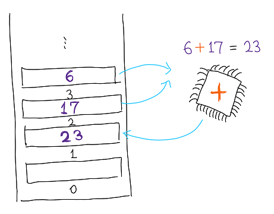
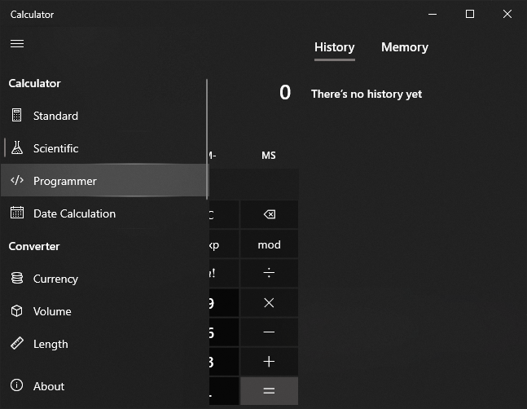

# 컴퓨터의 구조

C/C++ 문법을 더 쉽게 이해하기 위해 컴퓨터의 구조를 간단하게 다룹니다.

## 컴퓨터와 프로그램



프로그래밍이라는 건 컴퓨터에게 명령을 내리는 행위입니다. 따라서 프로그래밍에 익숙해지기 위해선 먼저 컴퓨터가 뭔가 고민해볼 필요가 있습니다. 컴퓨터는 정말 복잡한 장치이지만, 정말 단순하게 보자면 크게 `메모리`와, `연산장치` 두 가지로 이뤄진 기계로 볼 수 있습니다. 메모리는 도서관의 책장처럼 생긴 장치입니다. 책장의 각 층에는 밑에서부터 0번, 1번, ... 이런 식으로 번호가 차례대로 붙어있고, 숫자를 넣거나 꺼낼 수 있습니다. 연산장치는 주어진 명령에 따라 주어진 책장에서 숫자를 꺼내 연산한 후, 다시 주어진 책장에 숫자를 넣습니다. 프로그램은 바로 이 연산장치에 주어지는 명령어들입니다. 위에 그림에선 2번에서 17, 3번에서 6이란 숫자를 꺼내 그 둘을 더한 결과를 1번에 저장하고 있습니다. 이 상황을 `의사 코드(pseudo-code)`로 써보자면,
```
load 2
load 3
add
store 1
```
이런 식으로 표현할 수 있겠습니다.

> 의사 코드는 실제로 사용할 수 있는 코드는 아니지만 사람들의 이해를 돕기 위해 사용하는 가짜 코드입니다.

> 이 구조는 실제 컴퓨터의 구조와 차이가 있는데요, 앞으로 C/C++을 공부하면서 실제 컴퓨터와 비슷해지도록 확장할 예정입니다.

## 2진수

컴퓨터에 실제로 저장되는 것이 숫자라는 것을 알았으니, 어떻게 숫자가 저장되는지도 알 필요가 있습니다. 흔히 컴퓨터에 대해 생각하면 등장하는 이미지 중 하나가 010010101... 같이 표현되는 2진수입니다. 2진수에 대해 알기 위해선 먼저 10진수에 대해 생각해볼 필요가 있습니다. 예를 들어, 10진수 17843은 다음과 같이 분석됩니다.
```
17843 = 1 × 10⁴ + 7 × 10³ + 8 × 10² + 4 × 10¹ + 3 × 10⁰
```
여기서 mⁿ은 m의 n제곱입니다. 만의 자리의 숫자엔 만을, 천의 자리의 숫자엔 천을, 백의 자리의 숫자엔 백을, 이런 식으로 쭉 곱한 다음 전부 더한게 그 숫자인 것을 알 수 있습니다. 2진수는 여기서 10 대신에 2를 사용한 체계입니다. 10진수에서 각 자리에 0부터 9까지의 정수만 들어갈 수 있던 것처럼, 2진수는 각 자리에 0또는 1만 들어갈 수 있습니다. 예를 들어, 2진수 10110(2)은 다음과 같이 분석됩니다.
```
10110(2) = 1 × 2⁴ + 0 × 2³ + 1 × 2² + 1 × 2¹ + 0 × 2⁰
```
즉, 2진수 10110(2)는 10진수 22입니다.
2진수는 지금까지 사용해본 적 없기 때문에, 익숙하지 않으실 거라고 생각합니다. 다음 숫자들을 10진수 또는 2진수로 변환해보시면서, 감을 익히시길 바랍니다. 2진수에 적용된 띄어쓰기는 가독성을 위한 것입니다. 답은 바로 밑에 있습니다.

* 1 1101(2)
* 110 1111(2)
* 289
* 129

답

* 29
* 111
* 1 0010 0001(2)
* 1000 0001(2)

2진수를 10진수로 쉽게 변환하는 방법이 여러가지 있습니다. 일단 2의 거듭제곱들을 외워야 합니다.
```
2, 4, 8, 16, 32, 64, 128, 256, 512, 1024, ...
```
웬만한 사람들도 1024 이상은 잘 안 외웁니다. 2진수에 익숙해질 정도만 외워셔도 괜찮습니다.
1로만 이루어진 2진수의 10진수 변환 결과는 쉽게 구할 수 있습니다. 예를 들어 111(2)의 경우 1000(2)에서 1만 빼면 됩니다. 즉, 111(2)는 1000(2)의 변환 결과인 8에서 1을 뺀 7입니다. 이런 식으로 계산하면 다음과 같습니다.
```
11(2) = 3
111(2) = 7
1111(2) = 15
11111(2) = 31
...
```
그럼 이제 곱셈을 활용합니다. 예를 들어, 첫번째 문제의 11101(2)는 111(2) * 100(2) + 1(2)로 분해할 수 있습니다. 즉, 7 × 4 + 1 = 29입니다. 이렇게 복잡한 2진수도 빠르게 10진수로 변환할 수 있습니다.

> 2진수 계산이 어려우시다면, 윈도우의 기본 계산기 앱의 프로그래머용 계산기 기능을 활용하실 수 있습니다. 2진수 뿐만 아니라 밑에서 설명할 8진수와 16진수 변환도 지원합니다.



## 컴퓨터에 숫자가 저장되는 방법

컴퓨터는 전자회로로 이루어진 장치입니다. 전압은 여러 요인에 따라 잘 변하기 때문에, 컴퓨터를 만드는 사람들은 전압을 여러 개로 나누어 0부터 9로 간주하기 보다는, 전압이 충분히 작으면 0, 충분히 크면 1로 생각하기로 하고 2진수를 활용하였습니다. 실제로 메모리는 플립플롭이라고 하는, 0 또는 1을 저장할 수 있는 회로 수억개로 이루어져있습니다. 마찬가지로 연산장치도 2진수 숫자를 더하고, 빼고, 곱하고, 나누는 회로로 이루어져있습니다.
컴퓨터가 실수를 다룰 때도 2진수를 활용합니다. 예를 들어, 10진수 소수 2.57은
```
2.57 = 2 × 10⁰ + 5 ÷ 10¹ + 7 ÷ 10²
```
로 분석될 수 있는데요, 마찬가지로 1.11011(2)같은 2진수 소수를 생각할 수 있습니다. 이렇게 컴퓨터의 모든 작업은 2진수로 변환되어 처리됩니다.

## 8진수와 16진수

2진수는 컴퓨터가 실제로 숫자를 저장하는 방법에 가깝지만, 숫자가 조금만 커져도 길이가 크게 증가한다는 단점이 있습니다. 프로그래밍에선 이 문제를 해결하기 위해, 8진수와 16진수를 혼용해서 사용합니다. 보통 16진수가 8진수보다 훨씬 많이 사용됩니다. 8진수와 16진수도 마찬가지로 각 자리가 8과 16의 거듭제곱이고, 각 자리에 들어갈 수 있는 숫자가 0에서 7 또는 0에서 15로 제한되어있습니다.
그런데, 한 자리에 10부터 15를 적는 건 힘듭니다. 115(16)라는 숫자가 16의 자리에 11이 들어가고 1의 자리에 5가 들어간건지, 16의 자리에 1이 들어가고 1의 자리에 15가 들어간건지, 아니면 세자리 16진수인지 알 방법이 없습니다. 그래서 16진수에선 10부터 15대신 A에서 F를 활용합니다. 1 × 16 + 15를 표현할 땐 1F(16)로, 11 × 16 + 5를 표현할 때는 B5(16)로 씁니다.
8진수와 16진수는 큰 숫자도 짧게 쓸 수 있다는 장점 외에도, 2진수로 서로 변환하기 쉽다는 장점이 있습니다. 위의 2진수 문제들을 예시로 들어보겠습니다.

* 11101(2) = 29
```
8진수:
11 101
 3   5 -> 35(8)

16진수:
1 1101
1    D -> 1D(16)
```

* 1101111(2) = 111
```
8진수:
1 101 111
1   5   7 -> 157(8)

16진수:
110 1111
  6    F -> 6F(16)
```

이렇게 세자리 또는 네자리 씩 끊는걸로 쉽게 2진수를 8진수나 16진수로 변환할 수 있는 것을 알 수 있습니다. 2장을 읽는 동안 Visual Studio의 설치가 끝났을 것이라고 생각합니다. 다음 장을 읽어주세요.

[다음: Hello, world!](../3-hello-world)