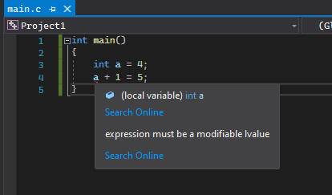
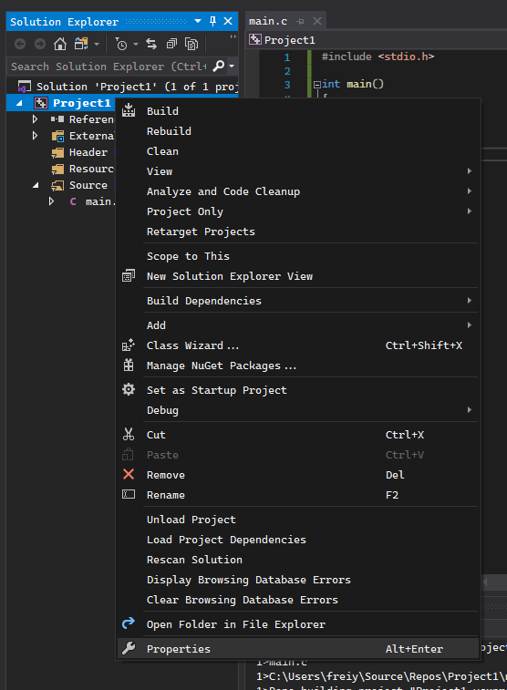
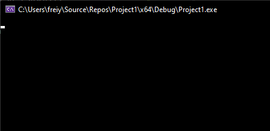
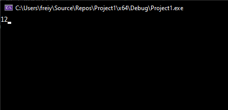

# 포인터와 배열

포인터와 배열에 대해 알아보고, 변수를 입력받는 방법에 대해 배웁니다.

## 메모리 주소(memory address)

[2장](../2-structure-of-computers)에서 메모리는 책장처럼 생긴 장치이고, 책장의 각 공간엔 밑에서부터 차례대로 번호가 붙어있다고 했었습니다. 이 번호를 실제로는 `메모리 주소(memory address)`라고 합니다. C에선 이 메모리 주소에 대해 덧셈과 뺄셈을 할 수 있는 기능을 제공하는데요, 이 때 `포인터(pointer)`라고 하는 자료형이 사용됩니다. 포인터는 메모리 주소를 담고 있는 자료형입니다. 즉, 일단 수학적으로 봤을 때 들어있는 형태는 정수입니다. 예를 들어 `int a`가 주소 36\~39를 차지하고 있다고 해봅시다. 그럼 포인터를 하나 만들고, 거기에 `int a`를 저장하는 공간의 가장 밑부분인 `36`을 그 포인터에 저장할 수 있습니다. 이 메모리 주소에 원하는 정수를 더하거나 빼는 것도 가능합니다.

## 포인터 선언하기

포인터 변수는 변수를 선언할 때, 변수 앞에 `*`를 붙여서 선언할 수 있습니다.

> 별표`*`는 사실 `애스터리스크(asterisk)`라는 이름이 있는데요, 다들 별표나 star라고 부릅니다.

```c
int main()
{
    int i = 5;
    int *p;
    p = &i;
}
```
변수 `i`는 지금까지 써 왔던 변수와 똑같습니다. 반면에, 변수 `p`는 선언할 때 앞에 `*`을 붙였기 때문에 포인터가 됩니다. 이 예제에서 알 수 있는 것은 여러가지인데요, 

* `p = &i`라는 식을 통해 `&`가 변수의 주소를 반환하는 단항 연산자임을 알 수 있습니다.
* 포인터를 선언할 땐 항상 어떤 자료형의 변수의 주소를 담을 건지 명시해야함을 알 수 있습니다.
* `*`가 변수의 선언에서 변수의 이름 앞에 붙으면 포인터임을 나타내는 표시가 된다는 것을 알 수 있습니다. `*`가 곱하기 말고도 여러 역할을 하는 것처럼, C에선 모양은 같지만 역할은 다른 경우가 여러가지 있습니다.

이 때 포인터 `p`의 자료형을 `int *`이라고 하는데요, 이 자료형을 풀어서 `int를 가리키는 포인터(a pointer to an integer)`라고도 합니다.

> `int`와 `*`은 다른 토큰으로 분리될 수 있기 때문에 `int* p` 라고 적어도 `p`가 포인터가 됩니다.

> `&`는 `주소 연산자(Address-of operator)`라고 불립니다. 주소 연산자는 형변환 연산자처럼 우선순위가 산술 연산자들보다 높고, 결합방향이 오른쪽에서 왼쪽입니다.

그럼 이 예제를 사람들이 쓰는 말에 가깝게 쓰면
```
프로그램이 시작했을 때,
    적당한 공간을 i라고 이름 짓고 정수 5를 넣습니다.
    적당한 공간을 p라고 이름 짓습니다.
    p라는 이름의 공간에 i의 주소를 담습니다.
```
가 됩니다. 즉, i가 48\~51번을 차지하고 있다면 p에는 48이 들어있게 됩니다.

> 포인터가 가리키는 자료형이 `float`이나 `double`이라고 하더라도 포인터는 메모리 주소를 담는 자료형이기 때문에 항상 정수를 담습니다. 이 때문에 포인터는 어떤 자료형을 가리키든간에 항상 같은 크기를 가지는데요, 보통 4바이트 또는 8바이트의 크기를 가집니다. 이것에 대해서는 나중에 자세히 다루도록 하겠습니다.

변수를 한 번에 여러 번 선언할 수 있는 것처럼, 포인터도 한 번에 여러 번 선언할 수 있습니다.
```c
int main()
{
    int *p, i = 5, *q = &i;
}
```
여기서 `p`와 `q`는 포인터이고, `i`는 그냥 자료형이 `int`인 변수입니다. 포인터 `p`는 초시식이 없기 때문에 어떤 값이 들어있는지 모르고, `q`는 초기식 `&i`가 주어졌기 때문에 `i`의 주소값을 갖게 됩니다.

## 포인터를 이용한 참조

[4장](../4-types-and-variables)에서 메모리 주소로만 프로그래밍을 하면 큰 프로그램을 개발하기 힘들어지기 때문에 변수라는 것이 생겼다는 설명을 했습니다. 여기서 특정한 메모리 공간에 값을 불러오고 계산한 후 다시 넣는 것을 변수라는 도구로 **추상화**할 수 있음을 배웠습니다. 포인터는 메모리 주소를 직접적으로 다룰 수 있는 도구입니다. 다시 말해, 메모리 공간에 들어있는 값을 넣고 빼고 계산할 수 있는 작업을 포인터로도 할 수 있습니다.
```c
#include <stdio.h>

int main()
{
    int i = 5;
    int *p;
    p = &i;
    *p = 6;
    printf("%d ", i);
    printf("%d", *p + 7);
}
```
```
6 13
```
여기서 `int *p;`와 `p = &i;`를 지우고, `*p`를 `i`로 교체해도 결과는 같습니다. 즉, `*p`가 `i`를 대체할 수 있는 것입니다. 이렇게 `*`은 곱셈 이항 연산자가 아니라 단항 연산자로 쓰였을 때, 포인터가 원래 가리키고 있는 변수를 가져올 수 있게 해주는 역할을 합니다. 이 예제를 컴파일했을 때 `i`가 64\~67번을, `p`가 68\~71번을 차지하고 있다고 가정해봅시다. 그럼 이 프로그램을 사람이 하는 말에 가깝게 옮기면,

| 문장 | 설명 | 실행 후 메모리 상태 |
| --- | --- | --- |
| `int i = 5;` | 64번을 `i`라고 이름 짓고, `i`라는 이름의 공간에 `5`를 넣습니다. |  |
| `int *p;` | 68번을 `p`라고 이름 짓습니다. |  |
| `p = &i;` | `p`라는 이름의 공간에 `i`라는 이름의 공간의 메모리 주소를 넣습니다. |  |
| `*p = 6;` | `p`라는 이름의 공간에 들어있는 메모리 주소를 가지는 공간에 `6`을 넣습니다. |  |
| `printf("%d ", i);` | `i`라는 이름의 공간에 들어있는 값을 출력합니다. (6 출력) |  |
| `printf("%d", *p + 7)` | `p`라는 이름의 공간에 들어있는 메모리 주소를 가지는 공간에 들어있는 값에 7을 더한 값을 출력합니다. (13 출력) |  |

이렇게 해석될 수 있습니다. 각 문장의 설명과 실행 후 메모리 상태를 유심히 봐주세요.

> `*`은 `참조 연산자(indirection operator)`라고 불립니다. 참조 연산자는 주소 연산자처럼 우선순위가 산술 연산자들보다 높고, 결합방향이 오른쪽에서 왼쪽입니다.

## 좌측값(lvalue)와 우측값(rvalue)

지금까지의 예제에선 대입 연산자의 좌항엔 항상 변수가 들어갔습니다. [5장](../5-basic-operators)에서 대입 연산자에서 자주 나오는 실수들에 대해 다뤘을 때, `a + 1 = 5`에서 `a + 1`이 주소를 가지는 변수가 아니기 때문에 대입 연산자의 좌항에 나오지 못한다고 설명했지만, 방금 위의 예제에선 변수가 아닌 식 `*p`가 대입 연산자의 왼쪽에 들어갔습니다. 그런데, `a`, `a + 1`, `*p` 모두 자료형은 `int`로, 자료형에는 차이가 없습니다. 그럼 C 컴파일러는 대입 연산자의 왼쪽에 올 수 있는 식을 어떻게 구분할까요?

C에선 식이 가질 수 있는 값을 `좌측값(lvalue)`과 `우측값(rvalue)`로 구분합니다. 좌측값은 그 값을 담고 있는 메모리 주소를 알 수 있는 값입니다. 예를 들어, 변수 `i`가 `5`라는 값을 가지고 있을 때, 식 `i`는 결과값이 `5`인 좌측값입니다. 즉, `5`가 담겨있는 메모리 주소를 알 수 있습니다. 마찬가지로, 변수 `p`가 `i`의 주소값을 가지는 포인터라면, 식 `*p`는 결과값이 `5`인 좌측값입니다. 포인터 `p`는 그 자체로도 변수이기 때문에, 식 `p`는 결과값이 `i`의 주소인 좌측값입니다. 반대로 식 `i + 1`은 결과값이 `6`이지만, 좌측값은 아닙니다. 마찬가지로, 식 `*p * 6`은 결과값이 `30`이지만, 좌측값은 아닙니다. 이렇게 좌측값이 아닌 값들을 우측값이라고 합니다.

대입 연산자의 왼쪽에 들어갈 수 있는 값은 바로 좌측값들입니다. 좌측값이라는 이름은 대입 연산자의 왼쪽에서 올 수 있다는 특징에서 유래했습니다. 마찬가지로 단항 연산자 `&`를 적용할 수 있는 식들은 결과값이 좌측값이어야 합니다. 다시 말해, `&(i + 1)`은 잘못된 식이지만, `&*p`는 올바른 식입니다.

> 여기서 `~의 결과값은`이란 표현은 제가 `~ is evaluated as`라는 표현을 번역한 것입니다.

> C++ 표준에선 식이 가질 수 있는 값을 lvalue, prvalue, xvalue, glvalue, rvalue 다섯가지로 구분합니다. 이것과 관련된 정확한 구분은 C++에 대해 배울 때 다루겠습니다.

다음 코드를 Visual Studio 에디터에 입력해주세요.
```c
int main()
{
    int a = 4;
    a + 1 = 5;
}
```

`a`에 빨간줄이 뜨면서 에디터에서 에러 메시지를 표시하는 것을 확인할 수 있습니다.



"expression must be a modifiable lvalue", 즉 "표현식이 수정 가능한 좌측값이어야 합니다"입니다. 실제로 `Ctrl + F5`를 눌러 실행해보려고 하면 컴파일러가 비슷한 메시지와 함께 에러를 표시하는 것을 확인할 수 있습니다.

## 포인터의 포인터(a pointer to a pointer)

포인터는 변수의 메모리 주소를 직접적으로 다루기 위한 자료형입니다. 근데, 포인터 자체도 변수입니다. 그래서 C에서는 포인터의 포인터도 만들 수 있습니다.

```c
#include <stdio.h>

int main()
{
    int i = 15, *p = &i, **pp = &p;
    printf("%d %d %d", i, *p, **pp);
}
```
```
15 15 15
```

변수 `p`의 자료형이 `int *`인 것처럼, `pp`도 자료형이 `int **`이고, 풀어서 `int를 가리키는 포인터를 가리키는 포인터(a pointer to a pointer to an integer)`라고 하고, 간단하게 `이중 포인터(double pointer)`라고도 합니다.

식 `**pp`는 참조 연산자의 결합방향에 의해 `*(*pp)`로 해석됩니다. `*pp`는 결과값이 `&i`인 `int *` 좌측값으로, `p`와 같습니다. 따라서 `*(*pp)`는 `*p`와 같습니다.

이중 포인터가 있는 것처럼 `삼중 포인터(triple pointer)`도 있고, 그 이상도 있습니다.

```c
int main()
{
    int i = 15;
    int *p1 = &i;
    int **p2 = &p1;
    int ***p3 = &p2;
    int ****p4 = &p3;
}
```

> 삼중 포인터부터는 잘 쓰이지 않습니다.

## 변수 입력받기

컴퓨터의 작동은 입력/계산/출력 세 가지로 분류할 수 있습니다. 지금까지 계산과 출력은 많이 했지만, 입력은 한 번도 한 적이 없는데요, 드디어 변수를 입력받는 방법을 다룰 수 있게 되었습니다. 출력을 `printf`라는 걸로 했던 것 처럼, 입력은 `scanf`라는 걸로 합니다. `scanf`를 사용하기 전, 필요한 사전작업이 있습니다. 솔루션 탐색기에서 프로젝트를 마우스 오른쪽 버튼으로 클릭한 후, `속성`을 눌러주세요.



그럼 다음과 같이 프로젝트의 속성 설정 창이 표시됩니다. 여기서 왼쪽의 메뉴에서 `C/C++` > `전처리기(Preprocessor)` 메뉴에 들어가주세요.


여기서 `Configuration`과 `Platform`을 모두 `All Configurations`과 `All Platforms`으로 바꾼 후, `Preprocessor Definitions`에 `_CRT_SECURE_NO_WARNINGS;`를 맨 앞에 넣어주세요. `_CRT_SECURE_NO_WARNINGS;` 까지 넣으신 것을 확인하셨으면 확인을 눌러주세요.


> Visual Studio의 컴파일러는 `scanf`에 보안 문제가 있어 `scanf` 사용을 원칙적으로 금지합니다. 하지만 저희는 C 문법을 배우고 있기 때문에, `scanf`를 사용하는 것은 큰 문제가 되지 않습니다. 이 작업은 그 금지 규칙을 해제하기 위한 것입니다.

다음 코드를 실행해주세요.
```c
#include <stdio.h>

int main()
{
    int i;
    int *p = &i;
    scanf("%d", p);
    printf("%d", i * 2);
}
```

프로그램이 실행하면, 커서가 깜빡이면서 아무것도 뜨지 않습니다.



이 상태로 무언가 입력하면, 글씨가 뜹니다. 백스페이스도 작동하고요.



이 상태로 엔터를 눌러주세요.


```
: 12
24
```

> 앞으로 `:`는 사용자의 입력 예시를 나타내는 표시로 사용하겠습니다.

입력한 정수의 두 배가 되는 정수가 출력된 것을 확인할 수 있습니다. 이 예제에서 `i`가 메모리 공간 120\~123을, `p`가 124\~127을 차지하고 있다고 가정하고, 각 문장을 자세히 살펴보겠습니다.

| 문장 | 설명 | 실행 후 메모리 상태 |
| --- | --- | --- |
| `int i;` | 120번을 `i`라고 이름 짓습니다. |  |
| `int *p = &i;` | 124번을 `p`라고 이름 짓고 `i`라는 이름의 공간의 메모리 주소를 넣습니다. |  |
| `scanf("%d", p);` | `p`라는 이름의 공간에 들어있는 메모리 주소를 가지는 공간에 사용자로부터 입력받은 정수를 넣습니다. (12 입력) |  |
| `printf("%d", i * 2)` | `i`라는 이름의 공간에 들어있는 값에 2을 곱한 값을 출력합니다. (24 출력) |  |

이렇게 `scanf`는 `printf`와 다르게 그 변수를 가리키는 포인터를 써야합니다. 위 예제에선 포인터 변수를 선언했지만, 변수 대신에 항상 식을 쓸 수 있다는 것을 잊지 말아주세요.

```c
#include <stdio.h>

int main()
{
    int i; scanf("%d", &i);
    printf("%d", i * 2);
}
```
```
: 12
24
```

`scanf`도 `print`처럼 여러 값을 받을 수 있고, `print`와 같은 형식 지정자를 사용합니다.

```c
#include <stdio.h>

int main()
{
    int i;
    double j; scanf("%d %lf", &i, &j);
    printf("%lf", j / i);
}
```
```
: 1 0.5
0.500000
```
`scanf`는 값을 스페이스 말고 엔터로도 구분합니다. 따라서 위의 예제를 실행했을 때,
```
: 1
: 0.5
```
로 입력해도 출력이 같습니다.

## 배열(array)

[4장](../4-types-and-variables) 도입부에서 소개한 BMI 프로그램을 다시 예시로 들겠습니다. 이제 변수도 쓸 수 있겠다, 입력도 받을 수 있겠다, 이제 프로그램을 만들어서 판매한 후 부자가 되는 일만 남은 것 같습니다. 빨리 돈을 벌고 싶으니 프로그램을 작성해보겠습니다.

```c
int main()
{
    int height_1, weight_1;
    int height_2, weight_2;
    int height_3, weight_3;
    ...
    int height_199, weight_199;
    int height_200, weight_200;
}
```

그런데 마침 프로그램을 판매하려고 했던 체육관에 사람들이 몰려 사용자 2000명의 BMI를 저장한 후 계산해야한다고 합니다. 회원 수가 급증하니 체육관이 더 발전해서 10000명의 회원이 등록하게 될 가능성이 충분히 있어 보입니다. 위에서 했던 일을 수십번 더 반복하는 건 좋은 일이 아닌 것 같습니다.

C에선 이렇게 비슷한 값들을 많이 받게 되는 경우를 위해 `배열(array)`이라는 것을 만들 수 있습니다. 배열은 같은 자료형을 가지는 값 여러개를 연속적인 메모리 공간에 저장한 것입니다. 이 값들의 개수는 프로그래머가 임의로 조절할 수 있습니다. 이 개수를 배열의 `길이(length)` 또는 `크기(size)`라고 합니다. 이 강좌에선 혼동을 방지하기 위해, 길이라는 용어를 사용하겠습니다. 배열은 변수를 선언할 때, 변수의 이름 뒤에 길이를 표시하는 것으로 만들 수 있습니다. 다음 예시를 봐주세요.

```c
int main()
{
    int i = 1;
    int arr[3];
    arr[0] = 2;
    arr[i] = 1 + arr[0];
    arr[i + 1] = 5;
    printf("%d %d %d", arr[0], arr[1], arr[2]);
}
```
```
2 3 5
```

이 예제에서 알 수 있는 점은 다음과 같습니다.

* `arr`이란 이름에 `[3]`을 붙였더니, `arr[0]`, `arr[1]`, `arr[2]`라는 변수처럼 보이는 것 세 개가 만들어졌습니다. 즉, 배열의 길이를 N으로 선언했을 때, `<배열의 이름>[0]` 부터 `<배열의 이름>[N - 1]`까지 N개를 사용할 수 있습니다.
* `[]`안에는 리터럴만 넣을 수 있는 것이 아니라 식을 넣을 수 있습니다. 즉, `[]`는 참조 연산자 `*`처럼 결과가 좌측값이 되는 이항 연산자입니다.

> `[]`는 `첨자 연산자(subscript operator)`라고 불립니다.

다른 변수 선언과 마찬가지로, 배열도 한번에 여러 개 선언할 수 있고, 초기식도 넣을 수 있습니다.

```c
#include <stdio.h>

int main()
{
    int i = 1, arr[10], arr2[3] = { 7, 11, 13 }, *j;
    printf("%d %d %d", arr2[0], arr2[1], arr2[2]);
}
```
```
7 11 13
```

여기서 `{}`도 여러 역할을 하는 것을 알 수 있습니다. `int main() { ... }`에서도 쓰이고, 배열을 초기화할 때도 쓰이는 것을 알 수 있습니다.

이 예제에선 `arr2`의 길이가 3이었지만, `arr2`의 길이가 10000이라면 초기식에 숫자를 10000개 써야할까요? 변수를 10000개 만드는 것과 수고스러움에 별 차이가 없어보입니다. 다행히도 C를 만든 사람들은 이런 경우에도 대처할 수 있는 방법을 만들었습니다.

```c
#include <stdio.h>

int main()
{
    int arr1[1000] = { 2, 3, 5, 7, };
    int arr2[500] = { 1, 1, 2 };
    int arr3[20] = { 0 };
    printf("%d %d %d", arr1[4], arr2[3], arr3[1]);
}
```
```
0 0 0
```

`arr1[3]`의 값이 `7`인 건 확실한데, `arr1[4]`부터는 값을 모르겠습니다. `arr2[3]`과 `arr3[1]`도 마찬가지고요. 그런데 실행해보면 전부 값이 `0`인 것을 알 수 있습니다. 왜냐하면 배열에 초기식이 주어지면 숫자를 쓰지 않은 부분부터 전부 `0`으로 초기화되도록 정해져있기 때문입니다. 이 기능 덕분에 배열의 길이가 아무리 길어도 전부 `0`으로 초기화하는 것이 가능하고, 정의되지 않는 행동을 막을 수 있을 것입니다.

> `arr1`의 초기식에서 `7`다음의 `,`에 주목해주세요. 오타가 아니라, 실제로 허용되는 문법입니다. 이렇게 초기식으로 사용되는 `{}` 안에선 `,`을 계속 이어서 쓸 수 있습니다.

C에선 배열을 더 쉽게 쓸 수 있도록 하기 위해 배열의 초기식이 주어지면 배열의 길이를 생략할 수도 있게 했습니다.

```c
#include <stdio.h>

int main()
{
    int arr1[] = { 2, 3, 5, 7, };
    int arr2[] = { 1, 1, 2 };
    printf("%d %d", arr1[2], arr2[1]);
}
```
```
5 1
```

위 코드를 Visual Studio 에디터에 입력하신 후, `arr1`과 `arr2` 위에 마우스를 올려주세요. 뭐가 표시되나요?


바로 `int arr1[4]`과 `int arr[3]`가 표시되는 것을 알 수 있습니다. 이렇게 초기식 안에 들어있는 숫자의 개수에 맞추어 배열의 크기를 조정할 수 있다는 것을 알 수 있습니다.